# Meeting Note

Huy Nguyen Quang

---
28/05/2026
# Nooploop 

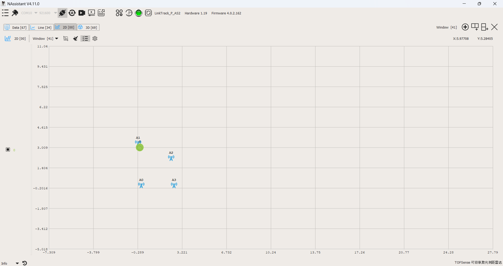 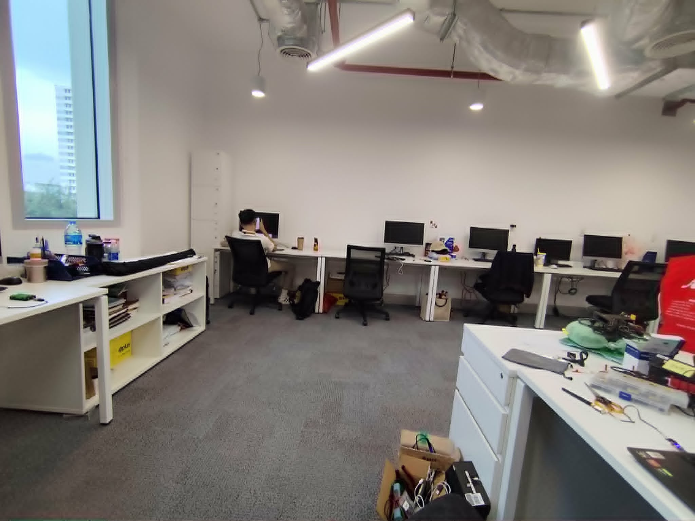 
 - The orientation of the antennas will affect the signal.
 - Do not place obstacles between anchors.

---
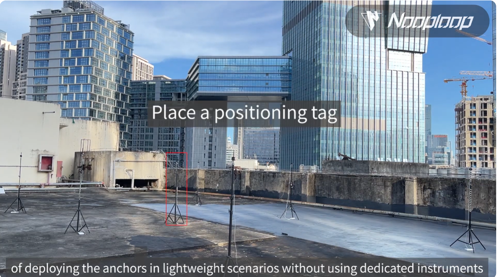
---
# ROVIO
 https://github.com/suyash023/rovio/tree/master

**D435i** (Infrared 30Hz / IMU 200Hz)
  ↓ *USB 3.2*
**ROS2 Node** (QoS: Best Effort)
  ↓
**QoS Relay** (Best Effort → Reliable)
  ↓
**ROVIO Node**  
  ↓
**Odometry**

---

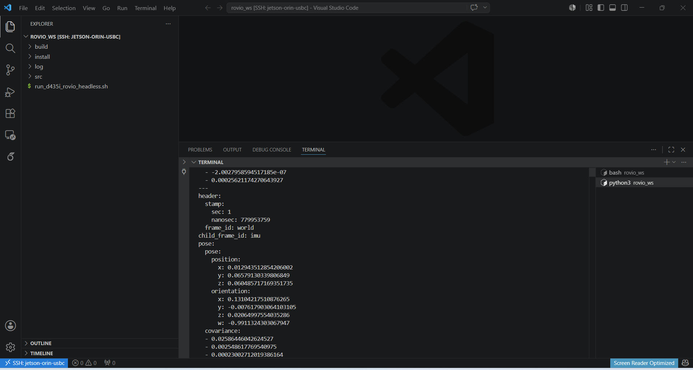

---
# Attaching a Camera to the Jetson
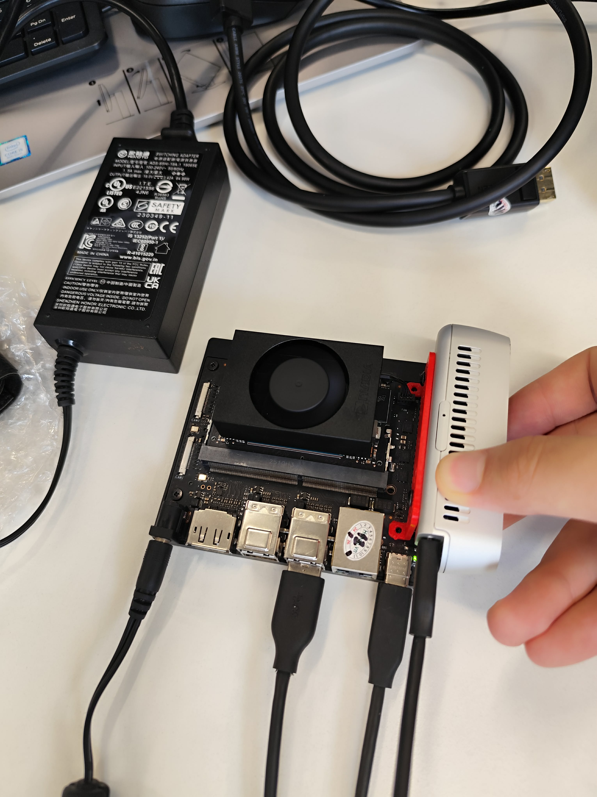 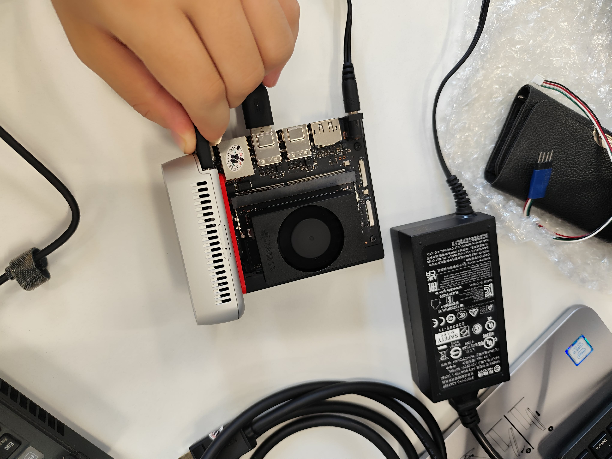

---
# IELTS
- Last week: Cam 16 1+2
- This week: Cam 16 3 + 4

---
8/06/2026
# Nooploop
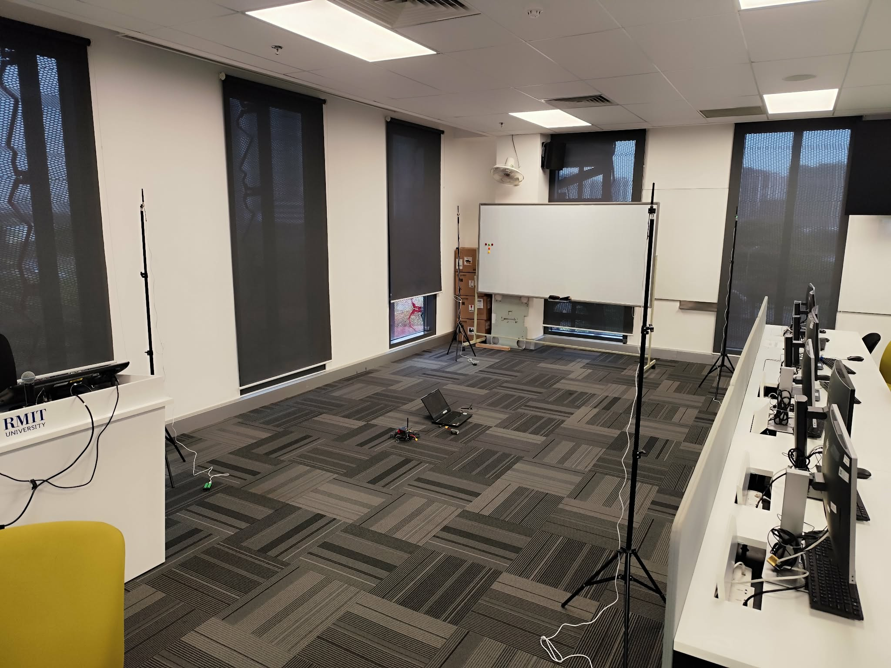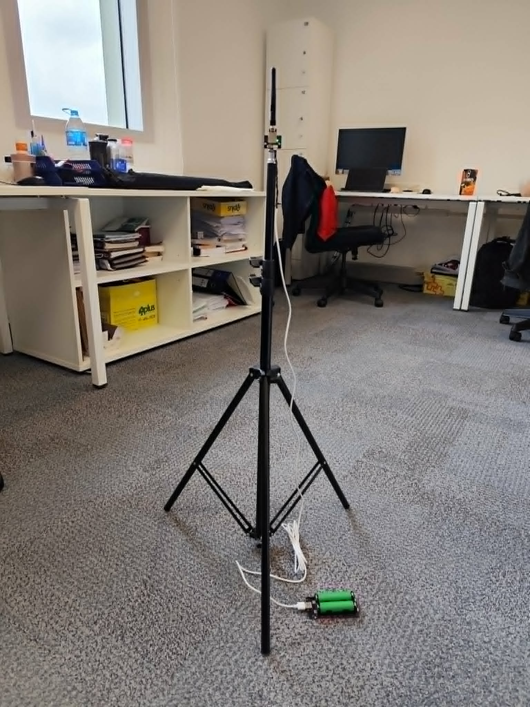

---
 - Move the tag into the anchor area.
 - Connect the tag to the FC and publish fake GPS.

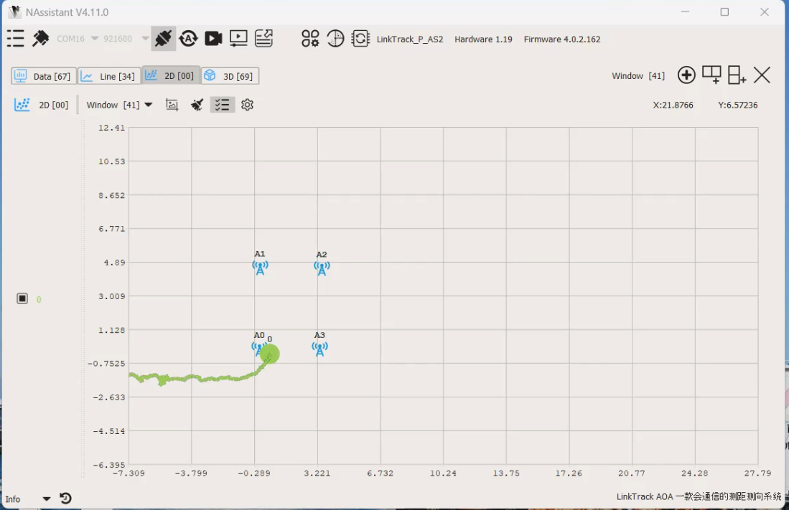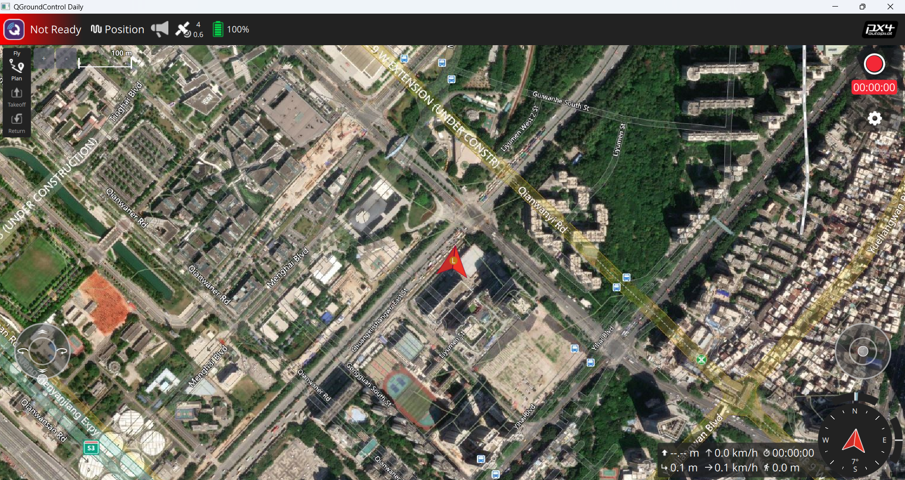

---
# VIO
- Compare VIO-D435i and T265

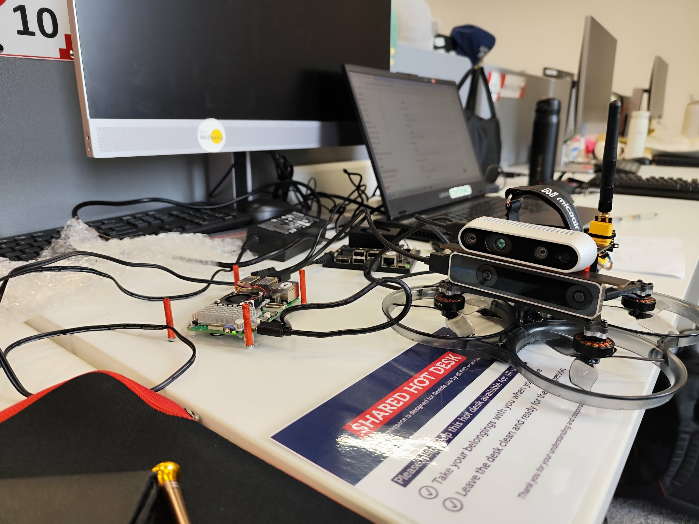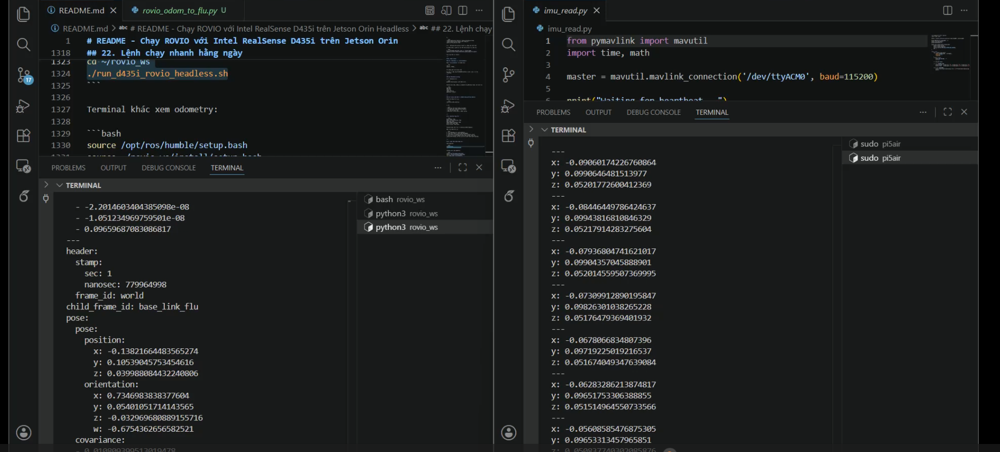

---
- Transmit data from camera D435i to the FC.
- MAVROS
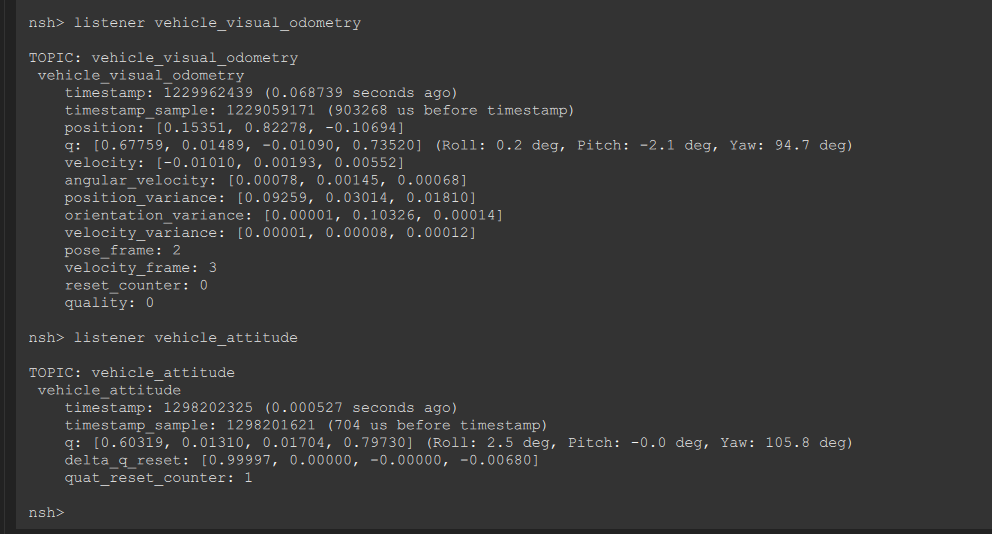

---
- Attached Jetson Orin with camera on the quad.
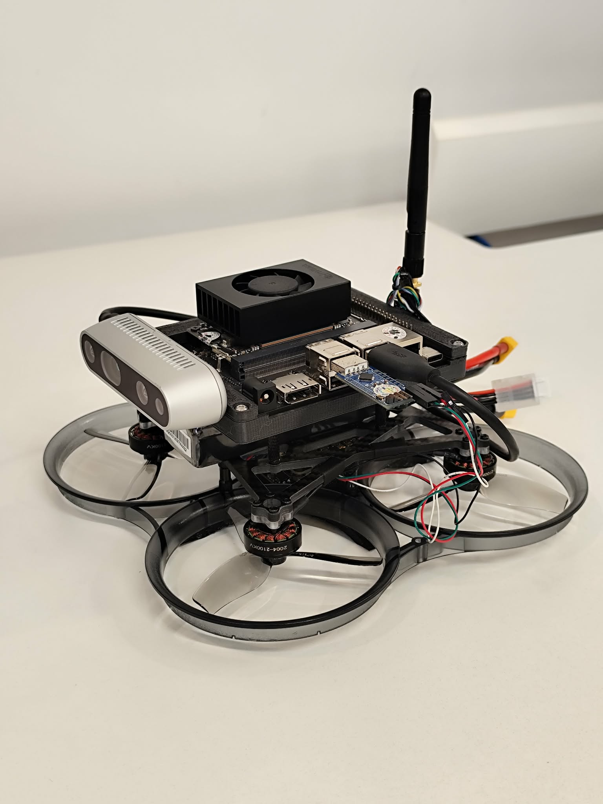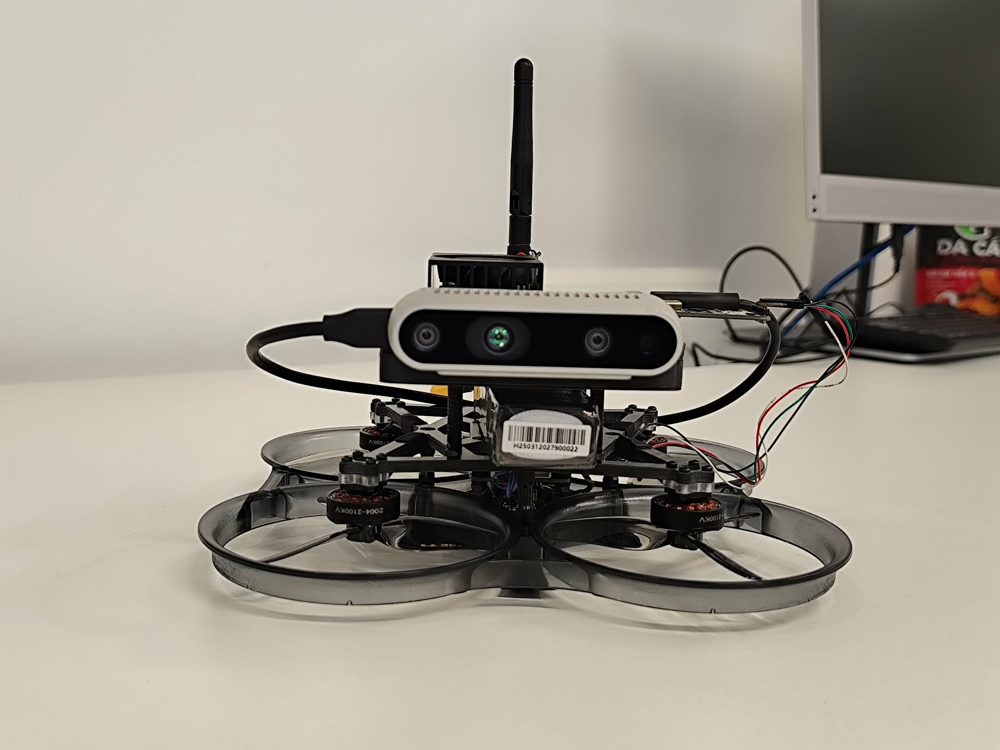