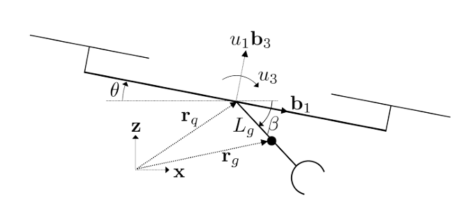

# Avian-Inspired Grasping for Quadrotor Micro UAVs
**Justin Thomas, Joe Polin, Koushil Sreenath, Vijay Kumar**  
University of Pennsylvania (2013)

---

# Mục đích
- Phát triển quadrotor MAV có khả năng **grasping tốc độ cao**.  
- Lấy cảm hứng từ **đại bàng săn mồi**.  
- Xây dựng mô hình động học và chứng minh **differential flatness**.  
- Sinh **quỹ đạo khả thi** và thiết kế **bộ điều khiển**.  

---

# Động học

Mô hình đơn giản trong mặt phẳng $x\!-\!z$.  

- Trạng thái: $(x_q, z_q)$, góc quadrotor $\theta$, góc gripper $\beta$.  
- Vị trí gripper:  

$$
r_g = r_q + L_g 
\begin{bmatrix}
\cos{\beta} \\
0 \\
-\sin{\beta}
\end{bmatrix}
$$

---

# Động học

- Thế năng:  
$$
V = m_q g z_q + m_g g z_g
$$

- Động năng:  
$$
T = \tfrac{1}{2}\Big(m_g \|\dot r_g\|^2 + m_q \|\dot r_q\|^2 
+ J_g \omega_g^2 + J_q \omega_q^2\Big)
$$

- Phương trình Euler–Lagrange:  
$$
\ddot q = D^{-1}(F - C\dot q - G)
$$

- Với:  
$$
q = \begin{bmatrix} x_q & z_q & \theta & \beta \end{bmatrix}^T
$$  

---

# Differential Flatness

- Hệ là **differentially flat** với flat outputs:  
$$
y = \begin{bmatrix} x_q & z_q & \beta \end{bmatrix}^T
$$

- Từ $y, \dot y, \ddot y, \ldots$ có thể khôi phục:  
  - **Trạng thái** $q = [x_q, z_q, \theta, \beta]^T$  
  - **Đầu vào** $u = [u_1, u_3, \tau]^T$  

---

# Differential Flatness 

1. **Tính lực nâng $u_1$**  
   - Dùng phương trình Newton–Euler (trung tâm khối hệ):  
   $$
   u_1 = m_s \,\|\, \ddot r_s + g e_3 \,\|
   $$
   với $m_s = m_q + m_g$, $r_s$ là vị trí CoM.  

2. **Tính góc attitude $\theta$**  
   - Hướng $b_3$ (vector lực) xác định $\theta$:  
   $$
   b_3 = \frac{\ddot r_s + g e_3}{\| \ddot r_s + g e_3\|}
   $$
---

# Differential Flatness 
3. **Tính moment $u_3$ và torque $\tau$**  
   - Lấy đạo hàm cao hơn (jerk, snap) của $y$ để suy ra $\dot\theta, \ddot\theta$.  
   - Khi đó:  
   $$
   u_3 = J_q \ddot\theta + \tau
   $$
   $$
   \tau = J_g \ddot\beta - L_g m_g \big(ẍ_g \sin\beta + (z̈_g + g)\cos\beta \big)
   $$

---

# Sinh quỹ đạo

- Quỹ đạo được sinh dựa trên ràng buộc:  
  - Vị trí bắt đầu/kết thúc với $\dot y = \ddot y = 0$.  
  - Tại thời điểm pickup: gripper hướng đúng mục tiêu.  

- Hàm chi phí:  
$$
J = \sum_{i=1}^3 \int_{t_0}^{t_f} \big( y_i^{(4)}(t) \big)^2 dt
$$

- Ý nghĩa:  
  - Giảm **snap** $\Rightarrow$ điều khiển mượt, ít dao động.  
  - Bài toán chuyển thành **Quadratic Programming (QP)**.  

---

# Bộ điều khiển

- Kiến trúc hai vòng:  
  - **Outer-loop** (100 Hz): điều khiển vị trí.  
  - **Inner-loop** (1 kHz): điều khiển attitude.  

- Lực điều khiển:  
$$
u_{1c} = k_{pz}(z_q^d - z_q) + k_{dz}(\dot z_q^d - \dot z_q) + u_1^d
$$

---

# Bộ điều khiển

- Moment điều khiển:  
$$
u_{3c} = k_{p\theta}(\theta_c - \theta) + k_{d\theta}(\dot\theta^d - \dot\theta) + u_3^d
$$

- Góc lệnh từ outer loop:  
$$
\theta_c = \sin^{-1}\!\Big(k_{px}(x_q^d - x_q) + k_{dx}(\dot x_q^d - \dot x_q)\Big) + \theta^d
$$

