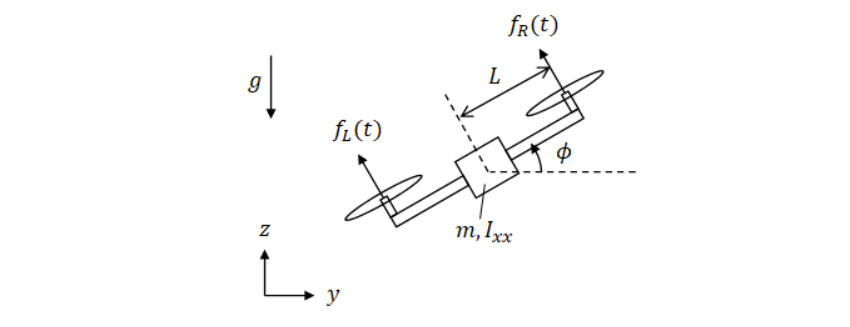

# Weekly Report

**Prepared by:** Huy Quang Nguyen    

**Date:** /2025

---

## Modelling 2D Quadrotor

Hệ thống quadrotor 2D với các tham số:
- Khối lượng: $m$
- Momen quán tính: $I_{xx}$
- Khoảng cách cánh: $L$
- Lực cánh trái: $f_L(t)$
- Lực cánh phải: $f_R(t)$
- Tọa độ: $q = (y, z, \phi)$

---
## Figure

---

## Năng lượng & Lagrangian

**Động năng**
$$
T = \tfrac{1}{2}m(\dot y^2+\dot z^2) + \tfrac{1}{2}I_{xx}\dot\phi^2
$$

**Thế năng**
$$
V = -mgz
$$

**Lagrangian**
$$
L = T - V = \tfrac{1}{2}m(\dot y^2+\dot z^2) + \tfrac{1}{2}I_{xx}\dot\phi^2 + mgz
$$

---

## Lực tổng quát

Tổng lực nâng:  
$$
U_1 = f_L + f_R
$$

Momen quay:  
$$
U_2 = L(f_R - f_L)
$$

Suy ra lực tổng quát:  
$$
Q_y = -U_1 \sin\phi,\quad Q_z = U_1 \cos\phi,\quad Q_\phi = U_2
$$

---

## Phương trình động lực học

Áp dụng Euler–Lagrange:
$$
\frac{d}{dt}\!\left(\frac{\partial L}{\partial \dot q_i}\right) - \frac{\partial L}{\partial q_i} = Q_i
$$

---

## Phương trình theo trục $y$

Từ Euler–Lagrange:
$$
\frac{\partial L}{\partial \dot y} = m\dot y
\;\;\Rightarrow\;\; 
\frac{d}{dt}\!\left(\frac{\partial L}{\partial \dot y}\right) = m\ddot y
$$

$$
\frac{\partial L}{\partial y} = 0
$$

Suy ra:
$$
m\ddot y = -U_1 \sin\phi = -(f_L+f_R)\sin\phi
$$

---

## Phương trình theo trục $z$

$$
\frac{\partial L}{\partial \dot z} = m\dot z
\;\;\Rightarrow\;\;
\frac{d}{dt}\!\left(\frac{\partial L}{\partial \dot z}\right) = m\ddot z
$$

$$
\frac{\partial L}{\partial z} = mg
$$

Suy ra:
$$
m\ddot z - mg = U_1 \cos\phi = (f_L+f_R)\cos\phi
$$

---

## Phương trình theo góc $\phi$

$$
\frac{\partial L}{\partial \dot \phi} = I_{xx}\dot \phi
\;\;\Rightarrow\;\;
\frac{d}{dt}\!\left(\frac{\partial L}{\partial \dot \phi}\right) = I_{xx}\ddot \phi
$$

$$
\frac{\partial L}{\partial \phi} = 0
$$

Suy ra:
$$
I_{xx}\ddot \phi = U_2 = L(f_R - f_L)
$$

---

## Hệ phương trình cuối cùng

$$
\left\{
\begin{aligned}
\ddot y &= -\frac{(f_L+f_R)}{m}\sin\phi \\[6pt]
\ddot z &= \frac{(f_L+f_R)}{m}\cos\phi - g \\[6pt]
\ddot \phi &= \frac{L(f_R - f_L)}{I_{xx}}
\end{aligned}
\right.
$$

---

## Kết luận

Hệ phương trình trên mô tả **động lực học 2D của quadrotor**:  
- Chuyển động ngang $y$ phụ thuộc vào góc nghiêng $\phi$ và tổng lực nâng.  
- Chuyển động thẳng đứng $z$ chịu tác động của tổng lực nâng và trọng lực.  
- Góc nghiêng $\phi$ phụ thuộc vào mô-men chênh lệch lực giữa hai cánh.  

---