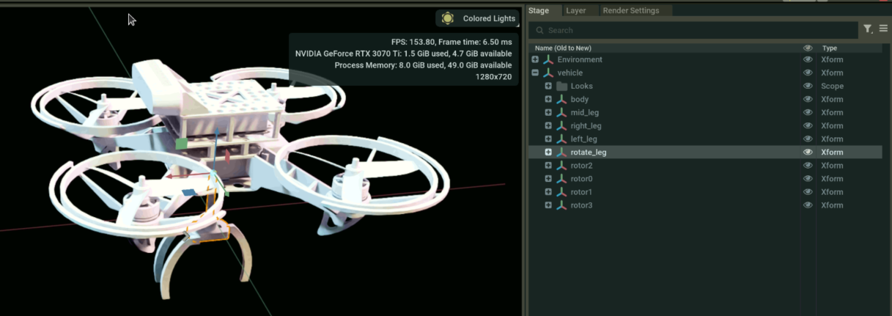
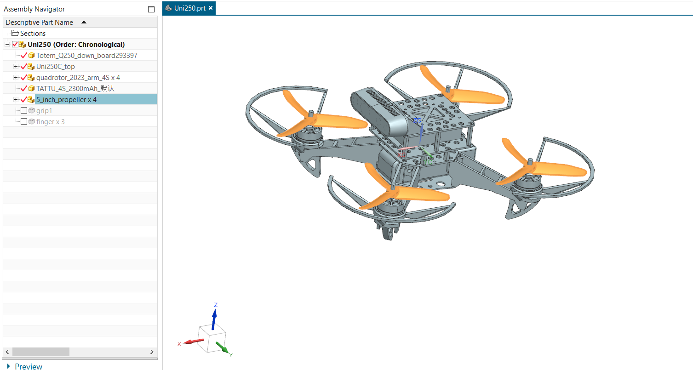

# Weekly Report

**Prepared by:** Huy Quang Nguyen    

**Date:** 08/08/2025

---

## Accomplishments

- **Completed Tasks:**  
    - Modified the gripper
    - Added to ISAACSIM
    

    
    

---

## Tasks in Progress

- Having problems with the new quad
    - Quad falls and cannot take off

---

## Tasks in Progress

- Edited quad from Dung

    

---

## Tasks in Progress

- Quad can fly from A to B

---

## Next Steps

- Find the cause of the USD file error
- Grip control

