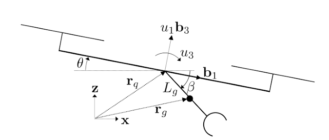

# Weekly Report

**Prepared by:** Huy Quang Nguyen    

**Date:** 26/09/2025

-  Paper : Avian-Inspired Grasping for Quadrotor Micro UAVs

---

# Accomplishments

- **Mục tiêu**: phát triển quadrotor MAV có khả năng **grasping tốc độ cao**
- **Động học**: mô hình trong mặt phẳng $x\!-\!z$, trạng thái gồm $(x_q, z_q, \theta, \beta)$.  
- **Differential Flatness**: hệ là *differentially flat* với flat outputs:  

    $$
    y = \begin{bmatrix} x_q & z_q & \beta \end{bmatrix}^T
    $$

---

# Dynamics

- Thế năng:  
$$
V = m_q g z_q + m_g g z_g
$$

- Động năng:  
$$
T = \tfrac{1}{2}\Big(m_g \|\dot r_g\|^2 + m_q \|\dot r_q\|^2 
+ J_g \omega_g^2 + J_q \omega_q^2\Big)
$$

---

# Dynamics

- Thế năng:  
$$
V = m_q g z_q + m_g g z_g
$$

- Động năng:  
$$
T = \tfrac{1}{2}\Big(m_g \|\dot r_g\|^2 + m_q \|\dot r_q\|^2 
+ J_g \omega_g^2 + J_q \omega_q^2\Big)
$$

- Phương trình Euler–Lagrange:  
$$
\ddot q = D^{-1}(F - C\dot q - G)
$$

- Với:  
$$
q = \begin{bmatrix} x_q & z_q & \theta & \beta \end{bmatrix}^T
$$  

---

# Differential Flatness

- Hệ là **differentially flat** với flat outputs:  
$$
y = \begin{bmatrix} x_q & z_q & \beta \end{bmatrix}^T
$$

- Từ $y, \dot y, \ddot y, \ldots$ có thể khôi phục:  
  - **Trạng thái** $q = [x_q, z_q, \theta, \beta]^T$  
  - **Đầu vào** $u = [u_1, u_3, \tau]^T$  

---

# Trajectory Planning

- Bài toán: tìm quỹ đạo $(x_q, z_q, \beta)$ mượt, thỏa mãn động học.  
- Ràng buộc:
  - Vị trí đầu/cuối cố định, với $\dot y = \ddot y = 0$.  
  - Tại thời điểm **pickup**: gripper phải hướng thẳng vào mục tiêu.  
- Dùng **differential flatness** để lập kế hoạch trực tiếp trên flat outputs.  

---

# Minimum-Snap Trajectory

- Ý tưởng: chọn quỹ đạo **minimum-snap**.  

$$
J = \sum_{i=1}^3 \int_{t_0}^{t_f} \big( y_i^{(4)}(t) \big)^2 dt
$$
  -  **Quadratic Programming (QP)**
---

# Position

  

---

# Angle

---
# Control

---
# 2-loop control
- **Outer loop**
  - Điều khiển trục (x) (vị trí ngang).
  - Công thức:

$$
\theta_c=\sin^{-1}\!\big(k_{px}(x_q^d-x_q)+k_{dx}(\dot{x}_q^d-\dot{x}_q)\big)+\theta^d
$$

- Thành phần:
  - **Feedback PD** theo $x$ và $\dot{x}$.
  - **Feedforward** $\theta^d$ từ planner.

---

# 2-loop control
- **Outer loop**
  - Điều khiển trục (z) (độ cao).
  - Công thức:

$$
u_{1c}=k_{pz}(z_q^d-z_q)+k_{dz}(\dot{z}_q^d-\dot{z}_q)+u_1^d
$$

- Thành phần:
  - **Feedback PD** theo $z$ và $\dot{z}$.
  - **Feedforward** $u_1^d$ từ planner.

---

# 2-loop control
- **Inner loop**

  - Điều khiển attitude (góc nghiêng $\theta$).
  - Công thức:

$$
u_{3c}=k_{p\theta}(\theta_c-\theta)+k_{d\theta}(\dot{\theta}^d-\dot{\theta})+u_3^d
$$

- Thành phần:
  - **Feedback PD** theo $\theta$, $\dot{\theta}$.
  - **Feedforward** $u_3^d$ từ planner.

---

# Result

- Quadrotor (500g) + gripper (158g).  
- Thử nghiệm với mục tiêu hình trụ (27g).  
- Kết quả:  
  - Thành công **100% ở vận tốc 2 m/s** (5/5 lần).  
  - Thành công cả ở **3 m/s** (≈ 9 body lengths/s).  

---
# Result

  

---
# Result

  

---
# Conclusion
- Thiết kế gripper mô phỏng chim săn mồi
- Mô hình động lực học phi tuyến
  - Phát triển mô hình động lực học cho hệ quadrotor + gripper.
  - Chứng minh hệ là differentially flat
- Lập quỹ đạo động sử dụng tính flatness
- Kết quả thực nghiệm với vận tốc cao

---

# Future Work

- **Visual servoing**  
  → Dùng camera & IMU onboard thay cho VICON.  

- **Perching**  
  → Đậu lên cành cây / mái nhà 

- **Lightweight gripper**  