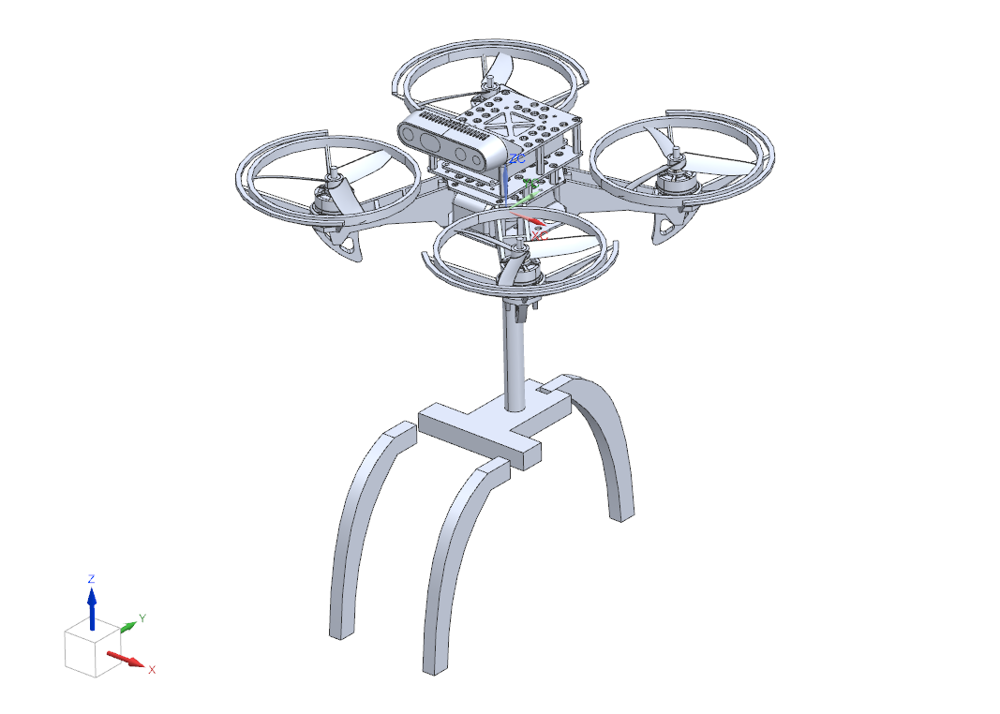

# Aerial Perching

**Prepared by:** Huy Quang Nguyen    

**Date:** 30/07/2025

---

## Accomplishments

- **Completed Tasks:**  
    - Understood the code  
    - Controlled the quadcopter to fly from A to B (inside the object)  

---

## Tasks in Progress

- Making the gripper  

---

## Tasks in Progress

- Adding the drone to ISAACSIM

---

## Next Steps

- Control the quadcopter to fly from A to B  

