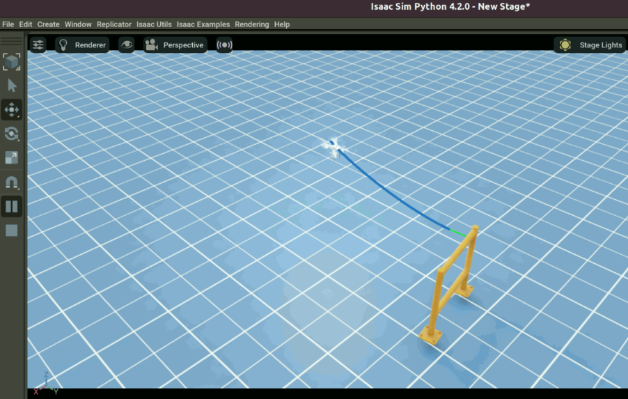
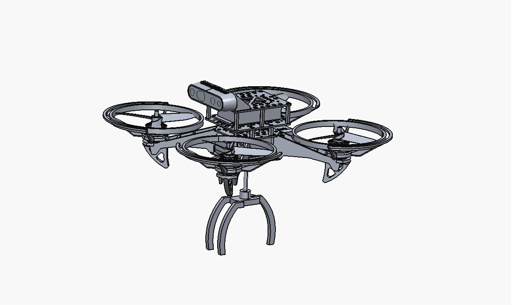
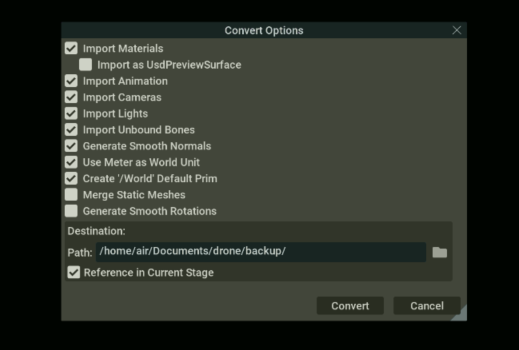

# Weekly Report

**Prepared by:** Huy Quang Nguyen    

**Date:** 08/08/2025

---

## Accomplishments

- **Completed Tasks:**  
    - Created a drone with a gripper
    

---

## Tasks in Progress

- Set up and run code on the new computer

  

---

## Tasks in Progress

- Modify the gripper

---

## Tasks in Progress

- Solve the problem when converting to USD in IsaacSim  

---

## Tasks in Progress

- Complete the setup for the new quadcopter

    

---

## Next Steps

- Control the quadcopter to fly from A to B  

